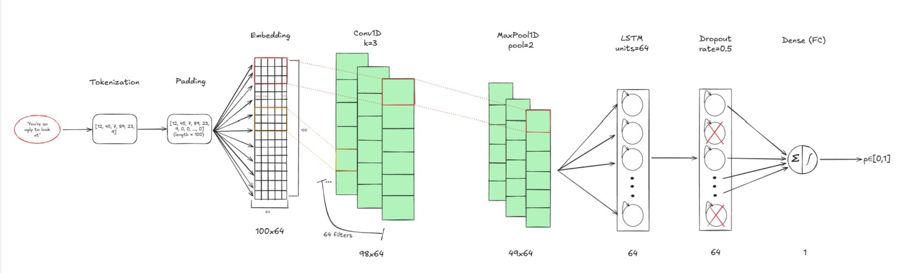

# SafeText: On-Device Detection of Cyberbullying and Hate Speech in Mobile Messaging

## Overview
* This app was built by me as a final project for the ECE 516 Mobile Applications course at George Mason University.
* The idea was to use machine learning technologies to detect incoming notifications on a mobile device as either safe or unsafe.
* If an incoming message is classified as unsafe, the message is blocked, and the user is sent an alternate notification by SafeText, alerting them of a potentially harmful message.

## Tech Stack
* **Languages:** Python for model training and testing, Kotlin for mobile development and deployment.
* **Frameworks:** Two different models were trained in this project. The transformer-based model DistilBERT was trained via **PyTorch**, while the custom CNN/LSTM hybrid model was trained in **TensorFlow**. The transformer model was converted into an **ONNX** model for mobile deployment via **ONNX Runtime Mobile**. The CNN/LSTM model was simply converted into a **TFLite Model**.

## Key Features
* The app will automatically detect incoming messages and classify them as either safe or unsafe. The last incoming notification, along with its respective classification, is always displayed on the app's landing page.
* App allows for toggling between the two different models for **testing** purposes. The incoming notification classifier will always use the **transformer** model.

## ML Model Specifics
* As stated earlier, I went with a dual-architecture approach for this project, mainly for learning purposes and to test just how much better a transformer model can perform at NLP tasks as opposed to non-attention-based models.
* The transformer model used was a pre-trained DistilBERT model (Victor Sanh, 2020). It was trained by me on a Kaggle toxicity dataset.
* The second model is a custom CNN/LSTM model consisting of 6 total layers: an embedding layer (100x64), a 1D convolutional layer (98x64 followed by a 1D maxpool of pool=2, then an LSTM layer with 64 units followed by a dropout layer with a rate of 0.5 to reduce overfitting, then lastly a single dense neuron with a sigmoid activation function. The result is a score p∈[0,1], if p >= 0.5, then the input is labeled as safe, else unsafe. The model architecture is shown below.

